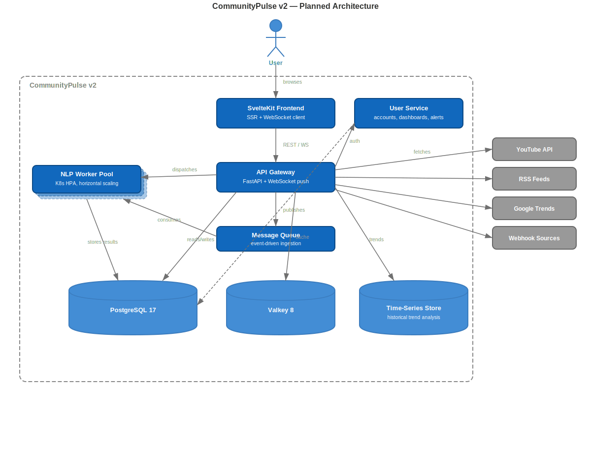
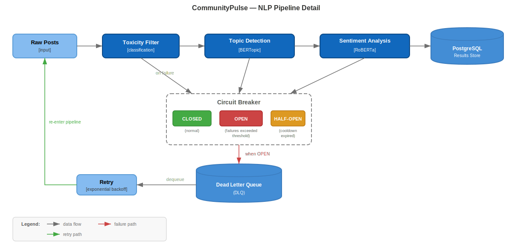
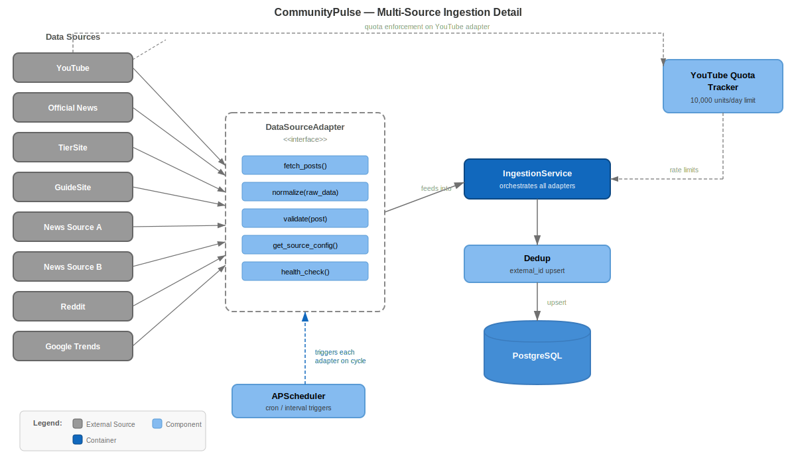

# CommunityPulse

**Gaming Community Sentiment Dashboard**

CommunityPulse aggregates sentiment and trends across multiple platforms — YouTube, community forums, news sites, and search trends — into a single dashboard. Players and content creators see what the community is talking about without manually browsing every source.

This project showcases cross-platform data ingestion, NLP-driven topic discovery, real-time sentiment tracking, and a responsive Svelte 5 frontend backed by a FastAPI async API.

---

## Tech Stack

| Layer | Technology |
|-------|------------|
| Frontend | SvelteKit 2 + Svelte 5 (runes: `$state`, `$derived`, `$effect`) |
| Backend | FastAPI (Python 3.11+), async SQLAlchemy 2, Pydantic v2 |
| Database | PostgreSQL 17 |
| Cache | Valkey 8 (Redis-compatible) |
| NLP | BERTopic + Sentence Transformers + cardiffnlp RoBERTa sentiment |
| Toxicity | Detoxify (Unitary) |
| AI Summaries | Google Gemini 1.5 Flash (optional) |
| Scheduling | APScheduler (async) |
| Container | Docker Compose (6 services) |

---

## Architecture

### Current State


**6-container Docker Compose deployment:**
- **SvelteKit frontend** — SSR + client hydration, Svelte 5 rune-based stores, CSS custom properties theming
- **FastAPI backend** — async request handling, Pydantic validation, structured error responses
- **NLP worker** — isolated container running BERTopic + sentiment + toxicity models (keeps API memory footprint low)
- **PostgreSQL** — relational store for posts, sentiment results, topic aggregations, dead letter queue
- **Valkey** — cache layer for aggregation snapshots, quota tracking, rate limiting
- **APScheduler** — 6-hour ingestion cycles across all sources, staggered NLP + aggregation passes

### Planned End-State



**Key additions in the roadmap:**
- WebSocket push for live topic updates (replacing polling)
- Kubernetes deployment with horizontal pod autoscaling on the NLP worker
- Event-driven ingestion via message queue (replacing scheduled polling)
- User accounts with saved dashboards and alert thresholds
- Historical trend graphs with time-series analysis

---

## Feature Spotlights

### NLP Pipeline



The NLP pipeline processes ingested posts through three stages:

1. **Topic Detection** — BERTopic clusters posts into dynamic topics using seed-guided vocabularies. Topics get human-readable names via Gemini API or a fallback dictionary.
2. **Sentiment Analysis** — cardiffnlp/twitter-roberta-base-sentiment-latest scores each post as positive/neutral/negative with confidence. Results are stored with a configurable TTL for re-analysis.
3. **Toxicity Filtering** — Detoxify screens posts before storage. Toxic content is flagged and excluded from aggregations.

**Resilience:** A circuit breaker wraps each model call — after N failures the circuit opens, and a dead letter queue captures posts for retry on the next scheduler pass.

### Multi-Source Ingestion



Eight data source adapters feed the pipeline:

| Source | Method | Rate Strategy |
|--------|--------|--------------|
| YouTube | Data API v3 | Daily quota tracking (9k/10k budget) |
| Official News | Publisher RSS | Locale-aware, 6-hour cycle |
| TierSite | Web scraping | Polite crawling with backoff |
| GuideSite | Web scraping | Polite crawling with backoff |
| News Source A | RSS feed | 30-item window per cycle |
| News Source B | RSS feed | 30-item window per cycle |
| Reddit | Public JSON API | No auth needed, 50-post window |
| Google Trends | pytrends | 60s inter-request delay, 12-hour cycle |

Each adapter implements a common `DataSourceAdapter` interface. The `IngestionService` handles deduplication (external ID upsert) and forwards clean posts to the NLP queue.

---

## Project Structure

```
gaming-community-analytics-tracker/
├── backend/
│   ├── app/
│   │   ├── api/routes/            # REST endpoints (dashboard, ingestion, feedback)
│   │   ├── dashboard/             # Aggregation, explanation generation, patch tracking
│   │   ├── ingestion/
│   │   │   ├── adapters/          # 8 data source adapters
│   │   │   ├── service.py         # Dedup + upsert orchestration
│   │   │   └── scheduler.py       # APScheduler job configuration
│   │   ├── models/                # SQLAlchemy async models
│   │   ├── nlp/
│   │   │   ├── topics.py          # BERTopic seed-guided clustering
│   │   │   ├── sentiment.py       # RoBERTa sentiment scoring
│   │   │   ├── toxicity.py        # Detoxify toxicity detection
│   │   │   ├── circuit_breaker.py # Failure isolation
│   │   │   └── dead_letter.py     # Retry queue for failed analyses
│   │   └── services/              # Digest generation, topic naming
│   ├── scripts/                   # Seed data, migrations
│   └── tests/                     # Pytest (async fixtures, mock NLP)
├── frontend/
│   ├── src/
│   │   ├── lib/
│   │   │   ├── components/        # TopicCard, SentimentBar, PatchPulse, etc.
│   │   │   ├── stores/            # Svelte 5 rune stores ($state, $derived)
│   │   │   └── i18n/              # Internationalization (English MVP)
│   │   └── routes/                # SvelteKit pages (dashboard, digest, patch-pulse)
│   └── e2e/                       # Playwright E2E tests
├── database/
│   ├── ddl/                       # Schema definitions
│   └── dml/                       # Seed data, migrations
├── docker-compose.yml             # 6-service orchestration
└── docs/                          # Architecture diagrams
```

---

## API Endpoints

### Dashboard
| Endpoint | Method | Description |
|----------|--------|-------------|
| `/api/dashboard/trending` | GET | Trending topics with sentiment |
| `/api/dashboard/topics` | GET | All topics list |
| `/api/dashboard/topics/{slug}` | GET | Single topic details |
| `/api/dashboard/sources` | GET | Source distribution |
| `/api/dashboard/patch-pulse` | GET | Current patch sentiment |
| `/api/dashboard/aggregate` | POST | Trigger aggregation |
| `/api/dashboard/digest/summary` | POST | AI digest summary |

### Feedback
| Endpoint | Method | Description |
|----------|--------|-------------|
| `/api/feedback/vote` | POST | Submit vote (thumbs up/down) |
| `/api/feedback/report` | POST | Report inaccurate topic |
| `/api/feedback/general` | POST | Submit general feedback |

### Ingestion
| Endpoint | Method | Description |
|----------|--------|-------------|
| `/api/ingestion/trigger` | POST | Trigger ingestion by platform |
| `/api/ingestion/status` | GET | All source statuses |
| `/api/ingestion/quota` | GET | YouTube API quota usage |
| `/api/ingestion/nlp-stats` | GET | NLP processing statistics |
| `/api/ingestion/nlp-sentiment` | POST | Trigger sentiment analysis |

### Health
| Endpoint | Method | Description |
|----------|--------|-------------|
| `/api/health` | GET | Health check with DB/cache status |

---

## Key Technical Decisions

| Decision | Optimized For | Trade-off |
|----------|---------------|-----------|
| Isolated NLP worker container | API memory stability (~200MB vs ~2GB with models loaded) | Extra container orchestration complexity |
| Circuit breaker + DLQ | Graceful degradation when models fail | Eventual consistency — posts analyzed on retry, not immediately |
| BERTopic with seed topics | Consistent topic categories across runs | Less dynamic than fully unsupervised clustering |
| Valkey cache for aggregations | Sub-50ms dashboard loads on cached data | Stale reads between aggregation cycles (up to 6 hours) |
| Session-based anonymous feedback | Privacy-first — no user accounts required for MVP | Limited per-user analytics |
| APScheduler in-process | Zero additional infrastructure for scheduling | Single point of failure — moves to message queue in roadmap |

---

## Security

- Environment-variable-only secrets (never committed, validated at startup)
- SQLAlchemy ORM with parameterized queries (SQL injection prevention)
- Pydantic validation on all request/response boundaries
- CORS restricted to frontend origin
- Structured error responses (no stack trace leakage)
- Toxicity filtering before any content reaches the dashboard
- Session IDs for anonymous feedback rate limiting

---

## Vision

CommunityPulse started as a way to answer a simple question: *what is the gaming community actually talking about right now?* The answer required pulling data from fragmented sources, applying NLP at scale, and surfacing results through an intuitive dashboard.

The technical approach prioritizes reliability and observability. Every model call is wrapped in a circuit breaker. Failed analyses land in a dead letter queue with automatic retry. The NLP worker runs in isolation so a model crash never takes down the API. Ingestion adapters share a common interface, making it straightforward to add new data sources.

Looking ahead, the roadmap moves from scheduled polling to event-driven ingestion, adds WebSocket push for real-time updates, and introduces user accounts with customizable alert thresholds. The architecture is designed to scale horizontally — the NLP worker is the natural first candidate for pod autoscaling under load.

---

## License

MIT License - See LICENSE file for details.
